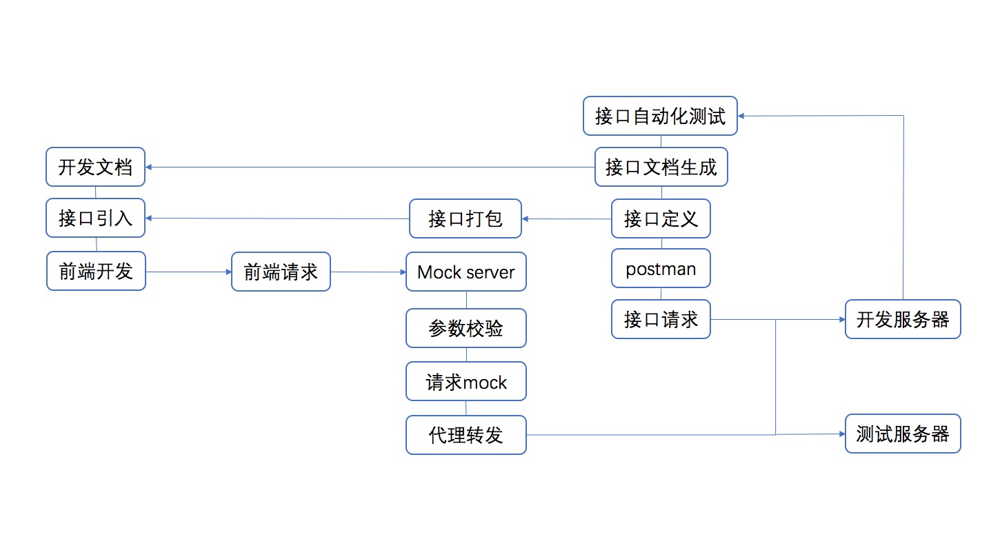

# mock-server



## 快速入门

### 请求配置

```js
{
 
  transformRequest: [function (data, headers) {
    // Do whatever you want to transform the data
    return data;
  }],
 
  transformResponse: [function (data) {
    // Do whatever you want to transform the data
    return data;
  }],
 
  paramsSerializer: function(params) {
    return Qs.stringify(params, {arrayFormat: 'brackets'})
  },
 
  timeout: 1000,
 
  adapter: function (config) {
    /* ... */
  },
 
  auth: {
    username: 'janedoe',
    password: 's00pers3cret'
  },
 
  // `responseType` indicates the type of data that the server will respond with
  // options are 'arraybuffer', 'blob', 'document', 'json', 'text', 'stream'
  responseType: 'json', // default
 
  // `xsrfCookieName` is the name of the cookie to use as a value for xsrf token
  xsrfCookieName: 'XSRF-TOKEN', // default
 
  // `xsrfHeaderName` is the name of the http header that carries the xsrf token value
  xsrfHeaderName: 'X-XSRF-TOKEN', // default
 
  // `onUploadProgress` allows handling of progress events for uploads
  onUploadProgress: function (progressEvent) {
    // Do whatever you want with the native progress event
  },
 
  // `onDownloadProgress` allows handling of progress events for downloads
  onDownloadProgress: function (progressEvent) {
    // Do whatever you want with the native progress event
  },
 
  // `httpAgent` and `httpsAgent` define a custom agent to be used when performing http
  // and https requests, respectively, in node.js. This allows options to be added like
  // `keepAlive` that are not enabled by default.
  httpAgent: new http.Agent({ keepAlive: true }),
  httpsAgent: new https.Agent({ keepAlive: true }),
 
  proxy: {
    host: '127.0.0.1',
    port: 9000,
    auth: {
      username: 'mikeymike',
      password: 'rapunz3l'
    }
  },
 
  cancelToken: new CancelToken(function (cancel) {

  })
}
```

### 参数验证规则

#### int

If type is `int`, there has tow addition rules:

- `max` - The maximum of the value, `value` must <= `max`.
- `min` - The minimum of the value, `value` must >= `min`.

#### integer

Alias to `int`.

#### number

If type is `number`, there has tow addition rules:

- `max` - The maximum of the value, `value` must <= `max`.
- `min` - The minimum of the value, `value` must >= `min`.

#### date

The `date` type want to match `YYYY-MM-DD` type date string.

#### dateTime

The `dateTime` type want to match `YYYY-MM-DD HH:mm:ss` type date string.

#### datetime

Alias to `dateTime`.

#### id

The `id` type want to match `/^\d+$/` type date string.

#### boolean

Match `boolean` type value.

#### bool

Alias to `boolean`

#### string

If type is `string`, there has four addition rules:

- `allowEmpty`(alias to `empty`) - allow empty string, default to false.
- `format` - A `RegExp` to check string's format.
- `max` - The maximum length of the string.
- `min` - The minimum length of the string.

#### email

The `email` type want to match [RFC 5322](http://tools.ietf.org/html/rfc5322#section-3.4) email address.

- `allowEmpty` - allow empty string, default is false.

#### password

The `password` type want to match `/^$/` type string.

- `compare` - Compare field to check equal, default null, not check.
- `max` - The maximum length of the password.
- `min` - The minimum length of the password, default is 6.

#### url

The `url` type want to match [web url](https://gist.github.com/dperini/729294).

#### enum

If type is `enum`, it requires an addition rule:

- `values` - An array of data, `value` must be one on them. ___this rule is required.___

#### object

If type is `object`, there has one addition rule:

- `rule` - An object that validate the properties ot the object.

#### array

If type is `array`, there has four addition rule:

- `itemType` - The type of every item in this array.
- `rule` - An object that validate the items of the array. Only work with `itemType`.
- `max` - The maximun length of the array.
- `min` - The minimun lenght of the array.

#### 暂时支持以下参数类型

- `'int'` => `{type: 'int', required: true}`
- `'integer'` => `{type: 'integer', required: true}`
- `'number'` => `{type: 'number', required: true}`
- `'date'` => `{type: 'date', required: true}`
- `'dateTime'` => `{type: 'dateTime', required: true}`
- `'id'` => `{type: 'id', required: true}`
- `'boolean'` => `{type: 'boolean', required: true}`
- `'bool'` => `{type: 'bool', required: true}`
- `'string'` => `{type: 'string', required: true, allowEmpty: false}`
- `'email'` => `{type: 'email', required: true, allowEmpty: false, format: EMAIL_RE}`
- `'password'` => `{type: 'password', required: true, allowEmpty: false, format: PASSWORD_RE, min: 6}`
- `'object'` => `{type: 'object', required: true}`
- `'array'` => `{type: 'array', required: true}`

### 本地开发

```bash
$ npm i
$ npm run dev
$ open http://localhost:7001/
```

### 部署

```bash
$ npm start
$ npm stop
```

### 单元测试
- [egg-bin] 内置了 [mocha], [thunk-mocha], [power-assert], [istanbul] 等框架，让你可以专注于写单元测试，无需理会配套工具。
- 断言库非常推荐使用 [power-assert]。
- 具体参见 [egg 文档 - 单元测试](https://eggjs.org/zh-cn/core/unittest)。

### 内置指令

- 使用 `npm run lint` 来做代码风格检查。
- 使用 `npm test` 来执行单元测试。
- 使用 `npm run autod` 来自动检测依赖更新，详细参见 [autod](https://www.npmjs.com/package/autod) 。